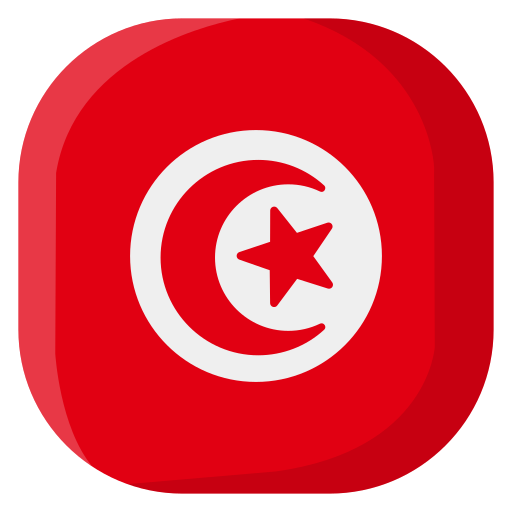

<h1 align="center"> Hi , I'm Imed.
</h1>

---

I'm a Young Software Engineer, Content Creator, Community Organizer, Self-Finder and Instructor from **Tunis, Tunisia** . I'm passionate about sharing knowledge, creating technology to help and elevate people, documentation, software engineering, communities and F/OSS.

I create technical content (on [dev.to](https://dev.to/3imed_jaberi) and [YouTube](https://youtube.com/channel/UCXOf69z-gIR7rTRtGQUdCMQ?sub_confirmation=1)), contribute, maintaine and make useful [open-source projects](https://github.com/3imed-jaberi), speak at meetups/conferences (locally 🇹🇳), present workshops and training sessions and build technical communities.

###  &nbsp;`WebSite` - [3imed-jaberi.com](https://www.3imed-jaberi.com/) &nbsp; | &nbsp; 

 

> My interest in the JavaScript ecosystem led me to launch [Tunisian JS Community](https://js-community.tn/), a community for Tunisian JS developers.

 

#  About me

- 🔭 &nbsp; I’m currently working on understanding myself...
- 📝 &nbsp; I write stuff at [dev.to/3imed_jaberi](https://dev.to/3imed_jaberi).
- 📺 &nbsp; I do some technical/mentor videos at .
<!-- - 🎙️ &nbsp; Host the [PRODCAST-NAME]() podcast. -->
- 🌱 &nbsp; I’m currently learning everything ...
- 🎓 &nbsp; I’m currently a software engineering student [@TEK-UP University](https://tek-up.de/).
- 👯 &nbsp; I’m looking to collaborate with on performance-related projects.
<!-- - 🤔 &nbsp; I’m looking for help with ... -->
- 👨🏻‍💻 &nbsp; Most of my projects are available on [Github](https://github.com/3imed-jaberi).
- 🤝 &nbsp; Welcom for everyone who need help or collaborator.
- ✅ &nbsp; 2021 Goals: prepare [Tunisian JS Community](https://js-community.tn/) to international stage by organized the [Summit v1.0](https://summit.js-community.tn/).

- 🥅 &nbsp; 2022 Goals: Work more on the [Tunisian JS Community](https://js-community.tn/) to improve the quality of events.
- 💬 &nbsp; Ask me about anything (within reason) [here](https://github.com/3imed-jaberi/ama)! I will be happy to help.
- 📫 &nbsp; How to reach me: &nbsp;
   &nbsp; 
- 😄 &nbsp; Pronouns: ... He/Him/His
- ⚡ &nbsp; I speak JavaScript .
- 👾 &nbsp; Fun fact: ... “A quitter never wins and a winner never quits.”

	
  
<b>🏆 Github Trophies</b>

	
  
 
    
    <!-- &title=MultiLanguage,Commit,Repositories,Issues -->
	

	
  
<b>📈 Github Stats</b>

  
 
    
	

 

   
    <i>
      <b>“Only JavaScript can distinguish between equality and equity ❤️.”<b>
    </i>
   
  ---
   
  <i dir="rtl">
    <b>”يمكن لجافا سكريبت فقط التمييز بين المساواة و العدل ❤️.“<b>
  </i>
   
   
    <h5>Copyright © Imed Jaberi</h5>

  

---

<!-- 

   
  

    <b>⚙️ Things I use to get stuff done</b>
  

  	<ul>
  	  <li><b>OS:</b> Windows 10 with WSL </li>
	    <li><b>Laptop: </b> Lenovo Ideapad 700 (i5/32gb)</li>
  	    <li><b>Browser: </b> Google Chrome Web Browser</li>
	    <li><b>Terminal: </b> ZSH: Oh My Zsh (PowerLevel10k)</li>
	    <li><b>Code Editor:</b> VSCode - The best editor out there.</li>
	</ul>

 -->
