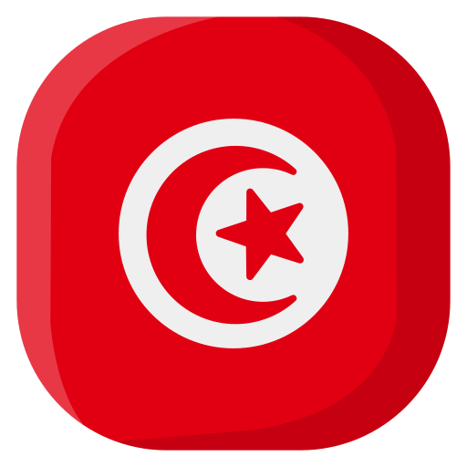
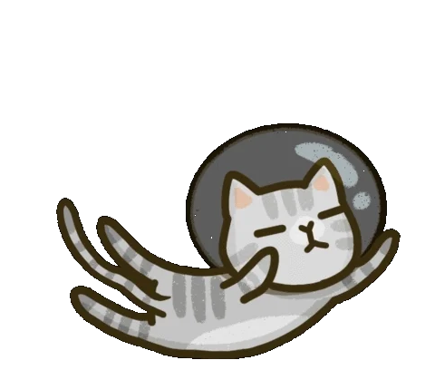
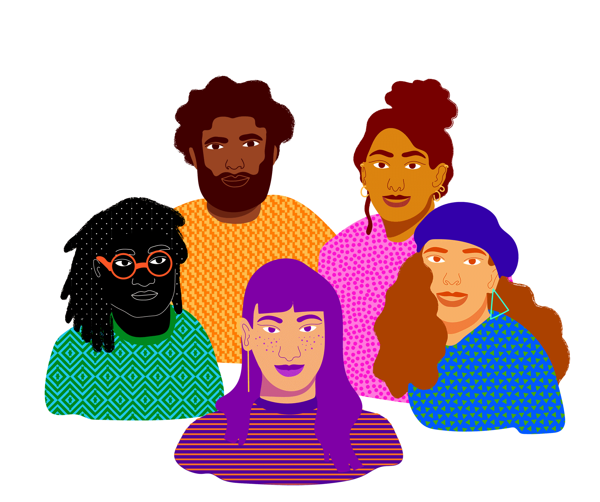

<h1 align="center"> Hi , I’m Imed.
</h1>

I’m a **Senior Software Engineer**, Content Creator, Community Organizer, and Instructor based in **Tunis, Tunisia** . Driven by curiosity and purpose, I’m passionate about using technology to uplift people, simplify complexity through clear documentation, and cultivate inclusive, knowledge-sharing communities. Whether I’m writing code, creating content, or leading initiatives, my mission is to empower others and build meaningful, open-source-driven impact.

I create technical content on [Dev.to](https://dev.to/3imed_jaberi) and [YouTube](https://youtube.com/channel/UCXOf69z-gIR7rTRtGQUdCMQ?sub_confirmation=1), actively contribute to and maintain [open-source projects](https://github.com/3imed-jaberi), speak at meetups and conferences both locally 🇹🇳 and internationally 🌍, lead workshops and training sessions, and help build and grow technical communities.

###  &nbsp;`WebSite` - [imed-jaberi.com](https://www.imed-jaberi.com/) &nbsp; | 

 

> My passion for the JavaScript ecosystem led me to found the [Tunisian JS Community](https://js-community.tn/), a space for Tunisian JS developers to connect and grow.

 

#  About me

- 🔭 &nbsp; I’m on a journey of continuous self-discovery and growth.
- 🏛️ &nbsp; I lead the frontend web and mobile development teams at [Paack](https://paack.co/), driving high-quality UI/UX and technical innovation.
- 📦 &nbsp; I built and maintain useful [npm packages](https://www.npmjs.com/~3imed-jaberi) for the JS/TS ecosystem.
- 🧰 &nbsp; I’ve contributed to major OSS projects like Koa, Express, React, Node, and more.
- 👨🏻‍💻 &nbsp; Most of my projects are available on [Github](https://github.com/3imed-jaberi).
- 📝 &nbsp; I write stuff at [dev.to/3imed_jaberi](https://dev.to/3imed_jaberi).
- 📺 &nbsp; I do some technical/mentor videos at .
- 🎙️ &nbsp; I’m available for public speaking, tech talks, and sharing my experiences at podcasts, conferences and meetups.
- 👯 &nbsp; I’m looking to collaborate on performance-related projects and open-source initiatives.
- 🤝 &nbsp; I’m open to mentoring, helping, and collaborating with anyone passionate about tech.
- 🌍 &nbsp; I actively engage in tech communities to exchange knowledge and help drive innovation.
- 👨‍🏫 &nbsp; I teach and mentor developers at all levels, guiding them through challenges and helping them reach their full potential.
- 🌱 &nbsp; Continuously learning and growing at all levels; technically, professionally, and personally.
- 👨🏻‍🎓 &nbsp; I earned a Bachelor’s degree in Computer Science [@ISAMM](http://www.isa2m.rnu.tn/) (2020).
- 🎓 &nbsp; I obtained an Engineer’s degree in Computer Science, majoring in Software Engineering [@TEK-UP University](https://tek-up.de/) (2024).
- 🚀 &nbsp; Dedicated to pushing the boundaries of technology while fostering a culture of excellence.
- 🎯&nbsp; Goals:
  - ✅ &nbsp; 2021 Goals: Prepare the [Tunisian JS Community](https://js-community.tn/) for the international stage by organizing [Summit v1.0](https://summit.js-community.tn/).
  - ✅ &nbsp; 2022 Goals: Improve the quality of events in the [Tunisian JS Community](https://js-community.tn/).
  - ✅ &nbsp; 2023 Goals: Keep contributing to open-source, speaking at tech conferences, and mentoring aspiring developers.
  - ✅ &nbsp; 2024 Goals: Focus on my graduation project and earn my Engineering degree in Computer Science, specializing in Software Engineering.
  - 🥅 &nbsp; 2025 Goals: Take better care of my physical and mental health through consistent exercise, healthy habits, and mindfulness.
- 💬 &nbsp; Ask me about anything (within reason) [here](https://github.com/3imed-jaberi/ama)! I’d be happy to help.
- 📫 &nbsp; How to `ping` me: &nbsp;
   &nbsp; |  &nbsp; | 
- 📖 &nbsp; I’m currently reading **Atomic Habits** by James Clear.
- 🎮 &nbsp; Let's connect for some fun, whether it’s Chess, Sudoku, FIFA, or any other game you enjoy!
- 😄 &nbsp; Pronouns: He/Him/His
- ⚡ &nbsp; I speak JavaScript .
- 👾 &nbsp; Fun fact: “A quitter never wins and a winner never quits.”

	
  
<b>🏆 Github Trophies</b>

	
  
 
    
    <!-- &title=MultiLanguage,Commit,Repositories,Issues -->
	

	
  
<b>📈 Github Stats</b>

  
 
    
	

 

   
    <i>
      <b>“Only JavaScript can distinguish between equality and equity ❤️.”<b>
    </i>
   
  ---
   
  <i dir="rtl">
    <b>فقط جافا سكريبت تستطيع التمييز بين المساواة و العدل ❤️.“<b>
  </i>
   
   
    <h5>Copyright © Imed Jaberi</h5>

 

<!--  <em><b>I love connecting with different people</b> so if you want to say <b>hi, I'll be happy to meet you more!</b> :)</em> -->

---

<!-- 

   
  

    <b>⚙️ Things I use to get stuff done</b>
  

  	<ul>
  	  <li><b>OS:</b> Windows 10 with WSL </li>
	    <li><b>Laptop: </b> Lenovo Ideapad 700 (i5/32gb)</li>
  	    <li><b>Browser: </b> Google Chrome Web Browser</li>
	    <li><b>Terminal: </b> ZSH: Oh My Zsh (PowerLevel10k)</li>
	    <li><b>Code Editor:</b> VSCode - The best editor out there.</li>
	</ul>

 -->
